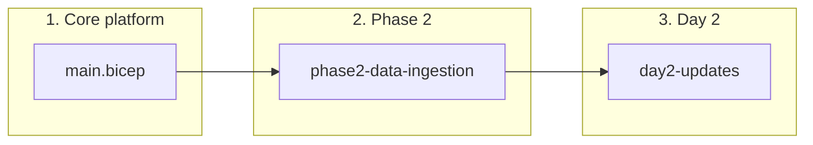
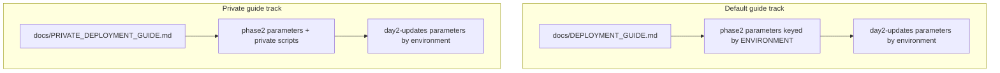

# How deployment fits together

This document is the **map** for the Bicep deployment tree under `data-pipelines/deployment/`. Use it when you need to know **which folder applies which change**, and **which guide matches your environment**.

## Canonical operator guides (start here)

All live in this directory (`docs/`):

| Document | When to use |
|----------|-------------|
| `DEPLOYMENT_GUIDE.md` | Default **non-private** path; use **`$ENVIRONMENT`** for naming and parameter file selection. |
| `PRIVATE_DEPLOYMENT_GUIDE.md` | **Private connectivity** path (`main.bicep` + Phase 2 private stack + hydration scripts); use **`$ENVIRONMENT`** consistent with your parameter files and main deployment name prefix. |
| `DAY2_UPDATES.md` | Day 2 incremental updates paired with **`DEPLOYMENT_GUIDE.md`**; parameter directory **`day2-updates/parameters/<environment>/`**. |
| `PRIVATE_DAY2_UPDATES.md` | Day 2 incremental updates paired with **`PRIVATE_DEPLOYMENT_GUIDE.md`**; parameter directory **`day2-updates/parameters/<environment>/`**. |
| `TEARDOWN.md` | Delete subscription resource groups created by **`main.bicep`** using **`scripts/destroy.ps1`** or **`scripts/destroy.sh`**. |

This file (`HOW_DEPLOYMENT_FITS_TOGETHER.md`) explains relationships and folder layout; it does not replace the step-by-step commands in the guides above.

## Glossary

| Term | Meaning |
|------|---------|
| **`main.bicep`** | Subscription-scoped orchestration under `azure-infrastructure/bicep-templates/main.bicep`. Creates resource groups and deploys core platform modules (network, data, security, compute hooks, optional AKS, Azure ML when enabled, and so on). |
| **Phase 2** | The **`phase2-data-ingestion/`** Bicep stack: integrations that sit on top of the core platform (service-centric modules and parameters under `parameters/`). Deployed at resource-group scope after `main.bicep` outputs exist. |
| **Day 2 updates** | The **`day2-updates/`** templates and scripts: targeted deltas such as Service Bus rules, storage containers and paths, Key Vault IAM, Functions storage/key RBAC, and PostgreSQL artifact apply. Parameters live under **`day2-updates/parameters/<environment>/`** (see subdirectories checked into the repo). |
| **`deployMlWorkspace`** | `main.bicep` parameter; **defaults to `true`** so the Azure Machine Learning workspace module runs in normal deployments. Set `false` only for exceptional cases. |
| **`deployAks`** | `main.bicep` parameter; **optional** by design. AKS is not required for the default data-path deployment unless you turn it on. |
| **`hydrate-phase2-parameters.ps1`** | In `azure-infrastructure/scripts/` (`deployment/bicep/azure-infrastructure/scripts/hydrate-phase2-parameters.ps1` from repo root). Fills Phase 2 JSON under `phase2-data-ingestion/` from `main.bicep` outputs and Azure queries—**all** modules’ parameter files for the chosen environment, not only Functions. Run **after** `main.bicep` and **again** after Phase 2 module deployments so values such as Service Bus namespace (for ADF) resolve. Do **not** commit hydrated JSON with tenant-specific names if policy forbids it. See `DEPLOYMENT_GUIDE.md` / `PRIVATE_DEPLOYMENT_GUIDE.md`. |
| **`set-vars-from-main-deployment.ps1`** | Script in `azure-infrastructure/scripts/` that reads outputs from a named subscription deployment and populates PowerShell variables (resource groups, storage account names, and so on) for Phase 2 and Day 2 commands. |

## Repository layout (deployment-focused)

```text
data-pipelines/deployment/
├── adf/                                      # Curated pipeline JSON (review/promotion); see README there
│   └── pipeline-training-data-ingestion/
└── bicep/
    ├── README.md                             # One-line index of the three main areas
    ├── azure-infrastructure/
    │   ├── bicep-templates/                  # main.bicep + platform modules
    │   ├── scripts/                          # set-vars, deploy helpers, …
    │   │   └── testing/                      # Optional phase test + teardown scripts (see scripts/testing/README.md)
    │   ├── docs/                             # CANONICAL runbooks (this folder)
    │   │   └── archive/                      # Retired deep analysis (e.g. network connectivity)
    │   └── azure-devops/                     # ADO pipeline YAML + setup notes
    ├── phase2-data-ingestion/              # Phase 2 Bicep + parameters; includes azure-data-factory/
    └── day2-updates/                        # Day 2 modules, parameters, scripts
```

## `azure-infrastructure/scripts/`

Holds the **operational** PowerShell and shell entrypoints you run from a workstation: loading subscription deployment outputs, **`hydrate-phase2-parameters.ps1`** (run after `main.bicep` and again after Phase 2—see the deployment guides), ordered Phase 2 deploy/what-if for private environments, **`destroy.ps1`** / **`destroy.sh`** (subscription RG cleanup—see **`docs/TEARDOWN.md`**), and various small utilities. The deployment guides reference these by name. This is the first place to look for **“how do I run the next step after `main.bicep`?”**

## `azure-infrastructure/scripts/testing/`

**Optional** quality gates: phase-oriented shell/PowerShell tests and teardown orchestration (`test-and-teardown.sh`, `test-and-teardown.ps1`, per-phase test scripts, and `README_POWERSHELL.md` for Windows usage). These help validate that a subscription or resource-group deployment **behaves** as expected; they are **not** the same as the product integration tests under `functions/`. See `scripts/testing/README.md` for script inventory and intended scope.

## `azure-infrastructure/azure-devops/`

Pipeline definitions and ADO setup notes for teams that deploy through Azure DevOps. The **source of truth for human-driven deploys** remains `docs/DEPLOYMENT_GUIDE.md` and `docs/PRIVATE_DEPLOYMENT_GUIDE.md`.

## Azure Data Factory: `deployment/adf` vs `phase2/.../azure-data-factory`

| Location | What it is | When to use it |
|----------|------------|----------------|
| **`data-pipelines/deployment/adf/`** (e.g. `pipeline-training-data-ingestion/`) | A **small, reviewable** pipeline JSON (and related manifest) kept in Git as the “golden” definition for that pipeline. | When you need a clean diff of **pipeline logic** for PR review or promotion between tenants. |
| **`phase2-data-ingestion/azure-data-factory/`** | **Infrastructure-as-code** for the Data Factory **resource**: Bicep (`data-factory.bicep`), parameter JSON per environment, **`live-export/`** snapshots from the portal, and helper scripts such as `export-live-adf-assets.ps1`. The Bicep module deploys the factory, managed VNet / IR wiring, and linked services; **canonical pipeline JSON is applied by the Phase 2 deployment flow** after that foundation exists (see comments in `data-factory.bicep`). | When you deploy or reconcile **factory infrastructure** and linked services—not a second copy of the golden pipeline folder. |

So this is **not** meaningless duplication: one path is **pipeline contract** in Git; the other is **factory + wiring + export history** for Bicep-driven deployment.

Details: [deployment/adf/README.md](../../../adf/README.md) and [phase2-data-ingestion/README.md](../../phase2-data-ingestion/README.md).

Completion checklist and dependency verification: [phase2-data-ingestion/azure-data-factory/ADF_COMPLETION_RUNBOOK.md](../../phase2-data-ingestion/azure-data-factory/ADF_COMPLETION_RUNBOOK.md).

## Archived analysis

`docs/archive/CONNECTIVITY_ANALYSIS.md` (if present) is **retired** reference material for network posture studies. Prefer current module behavior and the private deployment guide for private-network connectivity decisions.

## End-to-end flow

The platform expects a **repeatable sequence**: establish the subscription footprint, wire integration modules, then apply incremental Day 2 updates whenever contracts or RBAC need to change.



## Deployment tracks (`DEPLOYMENT_GUIDE.md` vs `PRIVATE_DEPLOYMENT_GUIDE.md`)

Use **`DEPLOYMENT_GUIDE.md`** when you deploy the **standard** subscription + Phase 2 flow without the private orchestration stack. Use **`PRIVATE_DEPLOYMENT_GUIDE.md`** when you deploy **private endpoints**, the jump host option, and Phase 2 modules via **`deploy-phase2-private.ps1`**. In both cases, set **`$ENVIRONMENT`** in PowerShell to match your **`main.<environment>.parameters.json`** file and the **`phase2-data-ingestion/**/parameters/*.json`** names you hydrate.



| Concern | Default guide (`DEPLOYMENT_GUIDE.md`) | Private guide (`PRIVATE_DEPLOYMENT_GUIDE.md`) |
|--------|---------------------------------------|-----------------------------------------------|
| Main deployment guide | `DEPLOYMENT_GUIDE.md` | `PRIVATE_DEPLOYMENT_GUIDE.md` |
| Phase 2 parameter files | Files under `phase2-data-ingestion/**/parameters/` named for **`$ENVIRONMENT`** | Same files; deploy Phase 2 via **private** orchestration scripts |
| Day 2 guide | `DAY2_UPDATES.md` | `PRIVATE_DAY2_UPDATES.md` |
| Day 2 parameters directory | `day2-updates/parameters/<environment>/` (see `DAY2_UPDATES.md`) | `day2-updates/parameters/<environment>/` (see `PRIVATE_DAY2_UPDATES.md`) |

**Networking posture:** The private guide deploys **private-by-default** connectivity (private endpoints, controlled ingress). The default guide follows the **standard** footprint from `DEPLOYMENT_GUIDE.md`. Tracks share the **same template families**; they differ by **parameter sets**, **scripts**, and **verification steps** appropriate to each **`$ENVIRONMENT`**.

## Phase 2 vs Day 2 (when to use which)

| Layer | Typical contents | When it runs |
|-------|------------------|--------------|
| **Phase 2** | Integration modules bundled under `phase2-data-ingestion/` (with environment-specific parameters) | After `main.bicep` completes and you have resource group names and storage/service identities from outputs. |
| **Day 2** | Smaller, frequent updates: Service Bus rules, storage layout, Key Vault and Function RBAC, SQL artifacts | After Phase 2 (or when operational changes require a delta without redeploying the entire Phase 2 stack). |

## Outputs you rely on across stages

`main.bicep` exposes outputs (including **`mlWorkspaceName`** when the ML module deploys) consumed by verification steps in the deployment guides. Phase 2 and Day 2 commands assume you have run **`set-vars-from-main-deployment.ps1`** (or equivalent) so `$DATA_RG`, `$SECURITY_RG`, **`$ML_RG`** (ML workspace resource group), **`$KEYVAULT_NAME`** (from main outputs), storage account variables, and related names resolve correctly. After Phase 2 exists in Azure, use **`-ResolveDataRgResources`** on that script to populate **`$SERVICEBUS_NAMESPACE`**, **`$ADF_NAME`**, **`$ADF_RG`**, and **`$FUNCTION_APP_NAMES`** from the data resource group.

## Where superseded material lives (local only)

The repository’s **`.gitignore`** excludes `**/deprecated/**` under the deployment tree and `data-pipelines/docs/deprecated/`, so that content is not published to the remote. On a fresh clone, only the guides in this `docs/` folder (and the function- or service-local runbooks) define the product.

For any new work, use **`docs/DEPLOYMENT_GUIDE.md`**, **`docs/PRIVATE_DEPLOYMENT_GUIDE.md`**, **`docs/DAY2_UPDATES.md`**, **`docs/PRIVATE_DAY2_UPDATES.md`**, and **`HOW_DEPLOYMENT_FITS_TOGETHER.md`**.
