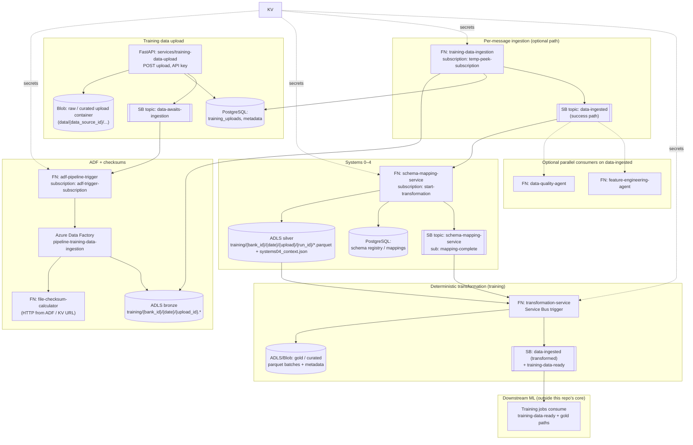
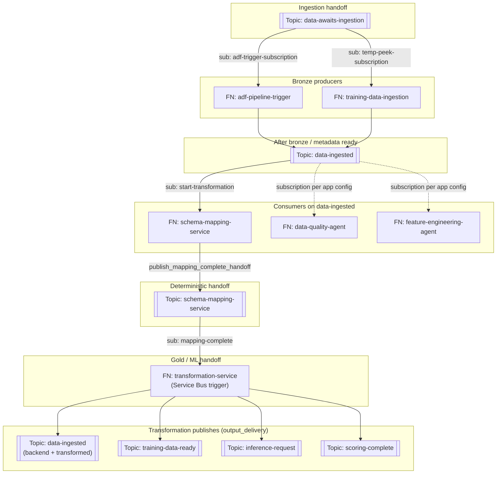
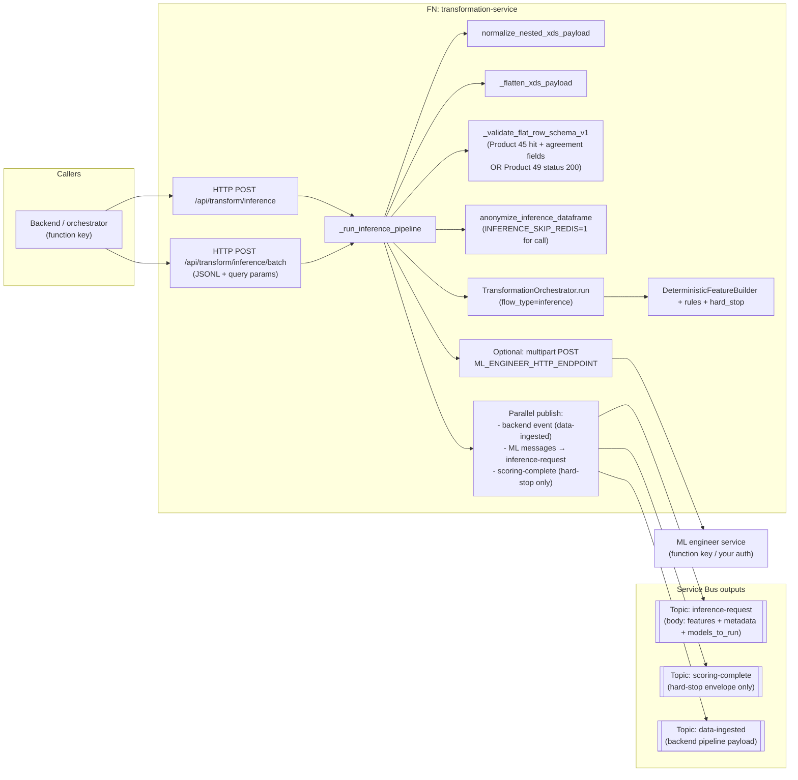

# Data Engineering (DE) — Architecture Diagrams

This document gives **end-to-end architecture** for the **training pipeline** and **inference pipeline** implemented under `data-pipelines/functions`, plus **security** and **private network** guidance. It complements [DE_PROCESSING_SYSTEMS_DEEP_DIVE.md](./DE_PROCESSING_SYSTEMS_DEEP_DIVE.md).

**How to read this file**

- **Visual diagrams** (PNG) are the primary view: flow is left-to-right with arrows.
- **Mermaid** blocks are kept as **editable source** for engineers who use Mermaid in GitHub / VS Code; they render as diagrams only where Mermaid is supported.

---

## Visual diagrams (primary)

### Training pipeline (data flow + Key Vault touchpoints)

### Inference pipeline (HTTP, transformation core, Service Bus, optional ML HTTP)

### Security and private network (hybrid today vs hardened target)

---

## Security architecture (DE scope)

### Secrets and configuration

| Practice | Detail |
|----------|--------|
| **No secrets in git** | Use `local.settings.json.example` only in-repo; real values in `local.settings.json` (gitignored) or Azure app settings. Never commit storage keys, Service Bus root SAS, or PostgreSQL passwords. |
| **Key Vault** | Store connection strings and API keys in **Key Vault**; reference from Function App settings with `@Microsoft.KeyVault(...)` where possible so the **host** resolves values before bindings run. |
| **Managed identity** | Prefer **user-assigned or system-assigned MI** on each Function App with **RBAC** to Key Vault (**Key Vault Secrets User**) and data plane (e.g. **Storage Blob Data Contributor** on specific containers, **Azure Service Bus Data** roles). |
| **Service Bus keys** | Avoid **`RootManageSharedAccessKey`** in application settings for least privilege; use **per-topic policies** or **Azure AD** (`DefaultAzureCredential`) where triggers support it. |
| **HTTP triggers** | Transformation inference/training routes use **`auth_level=FUNCTION`**: callers must send the **function key** (or host key) on `x-functions-key` / `code` query. Treat keys like secrets; rotate if exposed. |
| **ADF → Functions** | Checksum and similar calls use **function URL + key** from Key Vault (`adf-pipeline-trigger` pattern). |
| **Redis** | Schema-registry Redis is **opt-in** (`SCHEMA_REGISTRY_ENABLE_REDIS=1`); avoids unnecessary KV reads for `RedisConnectionString` in DE paths. |
| **Logging** | Host and Python defaults favor **Warning** to reduce accidental **PII or payload** emission in logs; use `LOG_LEVEL` / `--verbose` on scripts when debugging. |

### Component-specific patterns (this repo)

| Function app | Secrets pattern |
|--------------|-----------------|
| `schema-mapping-service` | **`KEY_VAULT_URL`** required at import. Data Lake: connection string **or** `DataLakeStorageAccountName` from KV + **AAD** to `dfs.core.windows.net`. |
| `training-data-ingestion` | **`KEY_VAULT_URL`** at runtime; `TrainingKeyVaultReader` resolves SB, blob, PostgreSQL, etc. |
| `adf-pipeline-trigger` | **`KEY_VAULT_URL`** + ADF IDs in settings; KV holds checksum **base URL + function key**, `ServiceBusNamespace`, etc. |
| `transformation-service` | **Often plain app settings** for `TRANSFORM_OUTPUT_*` and gold storage (publish path); optional **`KEY_VAULT_URL`** for LLM parity in `inference_anonymize.py`. Prefer **KV references** in Azure for production. |

### Operational hardening

- Enable **Microsoft Defender for Cloud** and **diagnostic settings** to Log Analytics.
- **Rotate** any credential that ever appeared in a committed file or shared clone, even if the repo was not pushed to a public remote.
- Use **separate** resource groups or subscriptions for **dev / staging / prod** with **Azure Policy** (HTTPS only, no anonymous storage, etc.).

---

## Private network architecture (options and constraints)

### What “full private” cannot mean

- **Azure Resource Manager** (portal, deployments, Bicep/Terraform control plane) remains over **HTTPS to public Azure APIs** unless you use specialized connectivity (e.g. **Private Link for Azure Management** in advanced setups).
- **External** HTTPS endpoints (e.g. a non-Azure **ML engineer** service) are often **still public** unless that service sits behind your own **private ingress** (App Gateway, Private Link to your tenant, etc.).

### Consumption plan (typical DE today)

- Function Apps are reached on **public** `*.azurewebsites.net` (HTTP triggers with **function keys**).
- **Outbound** calls from Functions to Service Bus, Storage, Key Vault, and PostgreSQL use **public Azure endpoints** unless those services are locked to **private endpoints only** — in which case the Function **must** have **network path** to those private IPs (see Premium below).
- **Service Bus triggers** on Consumption still need the runtime to reach Service Bus; **disabling public access** on the Service Bus namespace **without** giving the Functions host a private path will **break** triggers.

### Hardened pattern (recommended when you require private data plane)

1. **Azure Functions Premium (EP1+)** or **ASEv3** with **regional VNet integration** (outbound from the app into a dedicated subnet).
2. **Private Endpoints** for **Service Bus**, **Storage / ADLS**, **Key Vault**, **PostgreSQL Flexible Server**, and optionally **Azure Monitor** ingestion, with **Private DNS zones** linked to the VNet (`privatelink.servicebus.windows.net`, etc.).
3. **Disable public network access** on those resources **only after** validating DNS resolution and connectivity from a **jump box** or test Function in the same VNet.
4. **ADF**: use **Managed virtual network** / **Managed private endpoints** for data movement to private storage; ADF **control** remains via ARM.
5. **Optional**: **Private Endpoint** on the Function App itself for **inbound** private-only HTTP (often combined with **API Management** inside the VNet).

### Mapping to your preferences

- **First layer “everything private”** is achievable for **data-plane** services (storage, SB, KV, DB) **if** you move off **Consumption-only** for the components that must listen or connect privately, and you accept **hybrid** paths for ARM and external SaaS.
- **Function keys + public HTTP** for inference/training endpoints remain valid on **Consumption**; moving those endpoints **private** requires **Premium / APIM / Front Door** patterns above.

---

## Legend

| Symbol | Meaning |
|--------|--------|
| SB | Azure Service Bus **topic** |
| FN | Azure Function App (Python, v2 programming model where applicable) |
| ADLS | Azure Data Lake Storage Gen2 (filesystems `bronze`, `silver`, containers such as `curated`) |
| KV | Azure Key Vault (secrets + optional Key Vault **references** in app settings) |
| PG | PostgreSQL (training uploads, ingestion logs, schema registry tables) |

**Auth patterns in this repo**

- **HTTP Functions** (e.g. transformation inference routes): `auth_level=FUNCTION` → **function key** or admin key in `code` / `x-functions-key` query/header.
- **Service Bus triggers**: connection via app setting `ServiceBusConnectionString` (often a KV reference at deploy time).
- **Schema mapping / training ingestion / ADF trigger**: runtime reads **`KEY_VAULT_URL`** and uses **managed identity / `DefaultAzureCredential`** for Key Vault and data-plane where connection strings are omitted.

**Redis (schema registry cache)**

- **Off by default** for DE. Enable only for workloads that need the cache: `SCHEMA_REGISTRY_ENABLE_REDIS=1`. See `schema_registry/redis_client.py`.

---

## 1. Training pipeline — logical architecture (Mermaid source)

High-level order: **raw upload → bronze → schema & silver (Systems 0–4) → deterministic gold + events → ML training handoff**.

**Notes on the diagram**

1. **Two ways** to get from `data-awaits-ingestion` to bronze: **ADF** (primary design in `DATA_FACTORY_PIPELINE_DESIGN.md`) and/or **training-data-ingestion** Function logic (`run_training_ingestion.py`) depending on how you wire production.
2. **Schema mapping** listens on **`data-ingested`** / `start-transformation` but **filters** messages: it only runs the orchestrator for payloads that look like a **bronze handoff** (`bronze_blob_path`, `bank_id`/`data_source_id`, `training_upload_id`/`upload_id`), not arbitrary `data-ingested` messages (e.g. transformed-file notifications). See `schema-mapping-service/function_app.py` → `_is_schema_mapping_trigger`.
3. **Transformation** training path is triggered by **`schema-mapping-service` / `mapping-complete`**, not by `data-ingested` directly (see `transformation-service/function_app.py` `transformation_trigger`).
4. **Parallel agents** (`data-quality-agent`, `feature-engineering-agent`) are shown as **optional** branches: they also subscribe to `data-ingested` in the broader architecture doc; tighten filters in those apps if you need to avoid duplicate processing.

---

## 2. Training pipeline — Service Bus and HTTP surfaces (tables)

### 2.1 Topics and primary subscriptions (as implemented in code)

| Topic | Producer (examples) | Consumer (Function) | Subscription (code default) |
|-------|---------------------|---------------------|-----------------------------|
| `data-awaits-ingestion` | Upload service / tests | `adf-pipeline-trigger` | `adf-trigger-subscription` |
| same | same | `training-data-ingestion` | `temp-peek-subscription` |
| `data-ingested` | ADF / ingestion success | `schema-mapping-service` | `start-transformation` |
| same | various | `data-quality-agent`, `feature-engineering-agent` | (per project config) |
| `schema-mapping-service` | `ServiceBusWriter.publish_mapping_complete_handoff` | `transformation-service` | `mapping-complete` |
| `training-data-ready` | `transformation-service` / `output_delivery.publish_ml_messages` | ML platform | (your subscription) |
| `data-ingested` (again) | `publish_transformed_training_complete` | Backend / filters | `transformed` (application properties) |

### 2.2 Transformation service HTTP (training)

| Route | Method | Purpose |
|-------|--------|---------|
| `/api/transform/training` | POST | Single JSON **training** transform (full `TransformRequest`-style body), writes gold when configured, publishes SB messages. |

### 2.3 Service Bus topology (topics and subscriptions)

One-page view of **which Function listens on which topic/subscription** and **which topics transformation publishes to** (defaults from code / env). Subscription **SQL filters** in Azure are not shown—only the **default subscription names** wired in code.

Schema-mapping **filters** payloads on `data-ingested`; transformation **publishes** several shapes back onto `data-ingested` (full pipeline payload vs `transformed` subscription contract). Use **subscription filters** and **application properties** in Azure to isolate consumers.

---

## 3. Inference pipeline — logical architecture (Mermaid source)

Inference is **centered on `transformation-service`**: flatten + validate XDS-shaped input, **optional PII anonymization** aligned with schema-mapping, **deterministic feature + rule + hard-stop** pass, then **outputs** to Service Bus and optionally **multipart HTTP** to the ML engineer endpoint.

**Hard-stop-only `scoring-complete`**

- `publish_scoring_complete_hard_stop` runs only when `flow_type` is **inference** and `decision_package.hard_stop_triggered` is true (`output_delivery.py`). This gives the backend a **null-model-shaped** envelope without running full ML scoring.

**Training vs inference publishing inside `_run_inference_pipeline`**

- Inference calls `_transform_payload(..., publish_outputs=False)` then explicitly runs `publish_backend_event`, `publish_ml_messages`, and `publish_scoring_complete_hard_stop` in a thread pool (and optional ML HTTP post). **Training** path inside `_transform_payload` publishes gold + training-complete topics; inference strips `targets` before external publish.

---

## 4. Inference — configuration touchpoints (env / app settings)

| Variable | Role |
|----------|------|
| `TRANSFORM_OUTPUT_SERVICE_BUS_CONNECTION_STRING` | SB client for `publish_*` |
| `TRANSFORM_OUTPUT_TOPIC` | Default `data-ingested` for backend event |
| `INFERENCE_REQUEST_TOPIC` | Default `inference-request` |
| `SCORING_COMPLETE_TOPIC` | Default `scoring-complete` |
| `INFERENCE_REQUEST_DISABLE_SESSION_ID` | When truthy, messages sent **without** session ID |
| `ML_ENGINEER_HTTP_ENDPOINT` | If set, POST multipart parquet of feature row(s) |
| `INFERENCE_BATCH_MAX_LINES` | Cap for JSONL batch route (parsed int, clamped) |
| `WEBSITE_INSTANCE_ID` | Used to detect Azure runtime for **guardrail** validation (publish config present) |

---

## 5. Key Vault vs plain app settings (DE scope)

| Component | Typical pattern |
|-----------|-----------------|
| `schema-mapping-service` | **`KEY_VAULT_URL` required** at import; Data Lake via `DATALAKE_STORAGE_CONNECTION_STRING` **or** secret `DataLakeStorageAccountName` + AAD. |
| `training-data-ingestion` | **`KEY_VAULT_URL` required** at runtime; secrets for SB/PG/blob resolved via `TrainingKeyVaultReader` / env. |
| `adf-pipeline-trigger` | **`KEY_VAULT_URL` + ADF_*` RG/sub/factory**; KV holds `ServiceBusNamespace`, checksum function URL + key. |
| `transformation-service` | **Mostly plain env** for SB + gold storage connection strings (`output_delivery.py`, `function_app.py`); optional `KEY_VAULT_URL` for LLM/KV in `inference_anonymize.py`. |

---

## 6. Related docs in-repo

| Document | Use |
|----------|-----|
| [ARCHITECTURE.md](./ARCHITECTURE.md) | Older high-level component list (verify against code if drift). |
| [DATA_FACTORY_PIPELINE_DESIGN.md](./DATA_FACTORY_PIPELINE_DESIGN.md) | ADF activity-level design for bronze ingestion. |
| [INTEGRATION_E2E_RUNBOOK.md](./INTEGRATION_E2E_RUNBOOK.md) | Operational ordering for integration tests. |
| [BACKEND_TO_ML_TRANSFORMATION_FLOW.md](./BACKEND_TO_ML_TRANSFORMATION_FLOW.md) | Backend ↔ ML contracts. |

---

## Clarifications you may still want to decide (not inferred from code)

1. **Single vs dual path to bronze**: Will production always use **ADF only**, **Function ingestion only**, or both for different tenants?
2. **Subscription filters**: Exact SQL filters on `data-ingested` for `transformed` vs `start-transformation` in your Azure namespace.
3. **ML subscription names** on `training-data-ready` and `inference-request` (not hard-coded in transformation service beyond topic **names** in env defaults).
